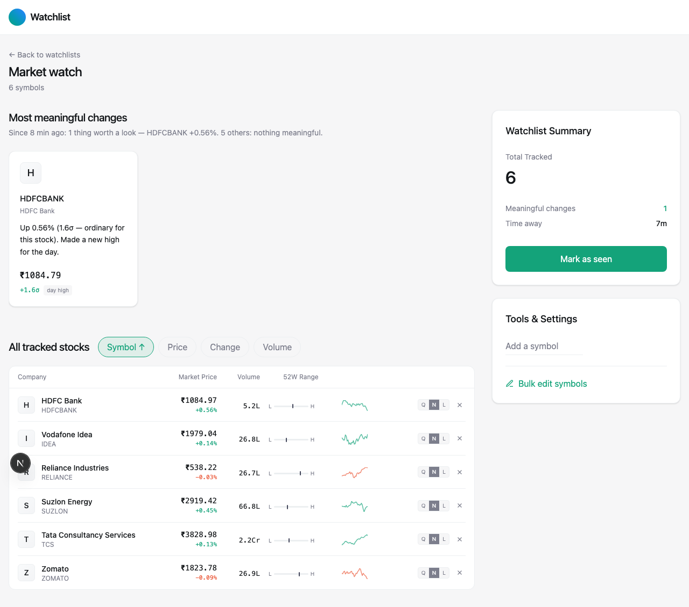

# Smart Market Watchlist — Project Overview

Built for **"Code, by Groww"** (solo, women-only, final-year hackathon). Full
reasoning trail lives in [INTERPRETATION.md](INTERPRETATION.md),
[IMPLEMENTATION_PLAN.md](IMPLEMENTATION_PLAN.md), and
[DECISIONS.md](DECISIONS.md) — this file is a map of what actually got built.

## What it is

A per-user diff engine over an unreliable market feed, not a price table.
The graded ask was "quickly understand what has meaningfully changed since
you last checked" — so the centerpiece is a checkpoint system: every visit
is an exact snapshot, "meaningful" is a z-score against each stock's own
volatility (not a flat %), and the feed is deliberately made to lie
(delayed, out-of-order, duplicate, corrected ticks) so the system has to
prove it never shows stale data as fresh or double-counts a change.

## Screenshot

The watchlist screen — ranked "most meaningful changes" (real z-score
output, not scripted) above the full sortable table with live price,
volume, 52-week range, and sparkline per row:



## File structure

```
groww-submission/
├── README.md                    Setup + how to run everything
├── PITCH.md                     200-word submission pitch
├── INTERPRETATION.md            How the brief was read; the core thesis
├── IMPLEMENTATION_PLAN.md       Full spec: architecture, schema, API, edge cases
├── DECISIONS.md                 Every non-obvious call made, and why
├── DESIGN_SYSTEM.md             Visual language ("calm instrument")
├── docker-compose.yml           Postgres for local dev
├── fixtures/changes.json        Sample API response fixture
│
├── backend/                     Node + TypeScript + Express + Postgres
│   ├── src/
│   │   ├── app.ts               Express app wiring (routes, middleware)
│   │   ├── index.ts             Process entrypoint (starts server + ingestor)
│   │   ├── config.ts            Env-driven config
│   │   ├── logger.ts            Structured logging
│   │   ├── changes/
│   │   │   ├── engine.ts        THE CENTERPIECE — pure function: last-seen
│   │   │   │                    state + current market + volatility →
│   │   │   │                    ranked changes with a one-line "why".
│   │   │   │                    No I/O, fully unit-tested.
│   │   │   └── stats.ts         Trailing per-symbol volatility (σ) from
│   │   │                        quote_history, cached with a 5s TTL.
│   │   ├── market/
│   │   │   ├── provider.ts          MarketDataProvider interface + fault types
│   │   │   ├── simulatedProvider.ts Deterministic seeded simulator (own
│   │   │   │                        volatility per symbol) + fault injection
│   │   │   │                        (delay/out-of-order/duplicate/correction)
│   │   │   └── ingestor.ts          One ingestor for the whole process;
│   │   │                            watches the UNION of all watchlists'
│   │   │                            symbols; monotonic SQL upsert so a late
│   │   │                            tick can never regress a stored quote.
│   │   ├── routes/
│   │   │   ├── watchlists.ts    CRUD: create/list/get, add/remove/replace
│   │   │   │                    items, sensitivity, optimistic-concurrency
│   │   │   │                    conflict handling (version field)
│   │   │   ├── changes.ts       GET /changes — the ranked diff since last
│   │   │   │                    checkpoint, with ETag/304 support
│   │   │   ├── checkpoint.ts    POST /checkpoint — commit "I've seen this"
│   │   │   ├── timeline.ts      Visit history + diff between any two visits
│   │   │   ├── sparklines.ts    Recent price history per symbol
│   │   │   ├── quotes.ts        Raw current quotes
│   │   │   ├── symbols.ts       Symbol search/autocomplete
│   │   │   ├── health.ts        Liveness/readiness + feed status
│   │   │   └── sim.ts           Fault-injection controls (demo/test only)
│   │   ├── middleware/
│   │   │   ├── userId.ts        Reads X-User-Id header → per-user scoping
│   │   │   └── errorHandler.ts  Central error → HTTP response mapping
│   │   ├── db/
│   │   │   ├── pool.ts          pg Pool
│   │   │   ├── migrate.ts       Migration runner
│   │   │   └── migrations/      001 init → 006 week-range (6 migrations,
│   │   │                        additive, run in order)
│   │   └── __tests__/
│   │       ├── engine.test.ts   12 unit tests on the diff engine
│   │       └── ingest.test.ts   6 integration tests against real Postgres
│   └── scripts/
│       ├── torture.ts           Spawns the REAL server, drives concurrent
│       │                        load + a hostile feed, SIGKILLs it mid-run,
│       │                        checks 21 invariants against an independent
│       │                        oracle. `npm run torture`.
│       └── scale-check.ts       Measures /changes latency at 50 concurrent
│                                 users × 500 symbols. `npm run scale-check`.
│
└── frontend/                    Next.js + TypeScript + Tailwind
    ├── src/
    │   ├── app/
    │   │   ├── layout.tsx        Root layout (Header + page)
    │   │   ├── page.tsx          Index — list watchlists, create new one
    │   │   ├── globals.css       Design tokens (light/dark), motion rules
    │   │   ├── w/[id]/
    │   │   │   ├── page.tsx      THE MAIN SCREEN — ranked meaningful
    │   │   │   │                 changes + full sortable list, sidebar
    │   │   │   │                 summary, bulk edit, conflict handling,
    │   │   │   │                 virtualization above 100 items
    │   │   │   └── history/page.tsx  Visit-history timeline + diff viewer
    │   │   └── dev/faults/page.tsx   Fault-injection demo controls (gated
    │   │                              behind NEXT_PUBLIC_SIM_ADMIN)
    │   ├── components/
    │   │   ├── WatchlistRow.tsx  One dense row (symbol, price, volume,
    │   │   │                     52W range, sparkline, sensitivity, remove)
    │   │   │                     — shared by the plain list and the
    │   │   │                     virtualized list, real <ul>/<li> markup
    │   │   ├── ChangeCard.tsx    Card for a single "meaningful change"
    │   │   ├── RangeBar.tsx      52-week low–high position indicator
    │   │   ├── Sparkline.tsx     Tiny inline price-history chart
    │   │   ├── StaleBadge.tsx    "data may be delayed" indicator
    │   │   ├── FeedStatusBar.tsx Global banner when the feed is degraded
    │   │   ├── AddSymbol.tsx     Symbol search + add
    │   │   ├── ConflictModal.tsx Keep-mine / keep-theirs / merge UI for a
    │   │   │                     genuine version conflict
    │   │   └── Header.tsx        App header
    │   └── lib/
    │       ├── api.ts            Typed API client (real backend or mock,
    │       │                     switched by NEXT_PUBLIC_USE_MOCK)
    │       └── mock.ts           In-memory mock backend — lets the e2e
    │                             suite and a fresh clone run with zero
    │                             backend/DB required
    └── tests/e2e/                 Playwright, mock-backed, 6 tests:
        ├── happy-path.spec.ts      open a watchlist, see ranked changes
        ├── checkpoint.spec.ts      mark-as-seen clears changes; first
        │                           visit shows baseline, not a fake change
        ├── conflict.spec.ts        genuine version conflict → modal → 
        │                           "keep mine" actually succeeds
        └── stale-feed.spec.ts      stale badge; degraded feed never
                                    blanks the page
```

## What's built and verified

**Backend** — full API per `IMPLEMENTATION_PLAN.md` §5: watchlist CRUD,
`/changes` (the ranked diff), `/checkpoint`, `/timeline` + diff, `/sparklines`,
fault injection for demos. 18 unit/integration tests pass, plus the
21-invariant torture test (concurrent load + hostile feed + SIGKILL mid-run)
and a scale check (50 users × 500 symbols, p50 279ms after a stats-cache fix
— see `DECISIONS.md`).

**Frontend** — index page, main catch-up screen (ranked changes + full
list with live price/volume/52-week range/sparkline and column sorting),
visit-history page, sensitivity control (quiet/normal/loud per symbol),
optimistic-concurrency conflict resolution with a real regression test,
virtualization above 100 items, dark mode, mobile-responsive rows, and a
6-test Playwright e2e suite that runs against an in-memory mock so a fresh
clone needs no backend to verify itself.

**Bugs found and fixed along the way** (full detail in `DECISIONS.md`):
a background-tab load that hung on "Loading…" forever (wrongly gated on
`document.visibilityState`), a stale-version retry loop in the conflict
modal, and — most recently — a batch of regressions introduced by an
unrelated automated pass that briefly reskinned the UI as a Groww lookalike
(runtime crash on real price data, list markup silently downgraded from
`<ul>/<li>` to `<div>`s breaking both accessibility and 4 of 6 e2e tests,
the watchlist name/back-link disappearing from the page entirely, a dropped
focus-ring color token, and literal Groww brand chrome with a fake ticker
tape of hardcoded numbers) — all reviewed, fixed, and reverified against the
real backend before this file was written.
